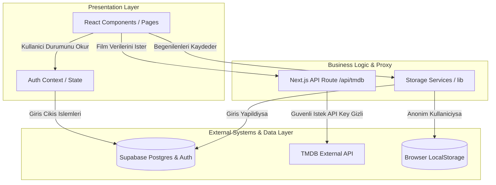
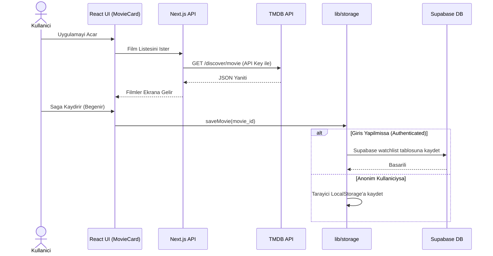
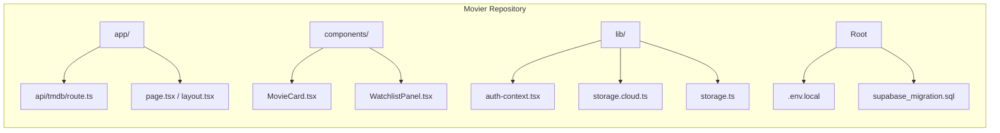
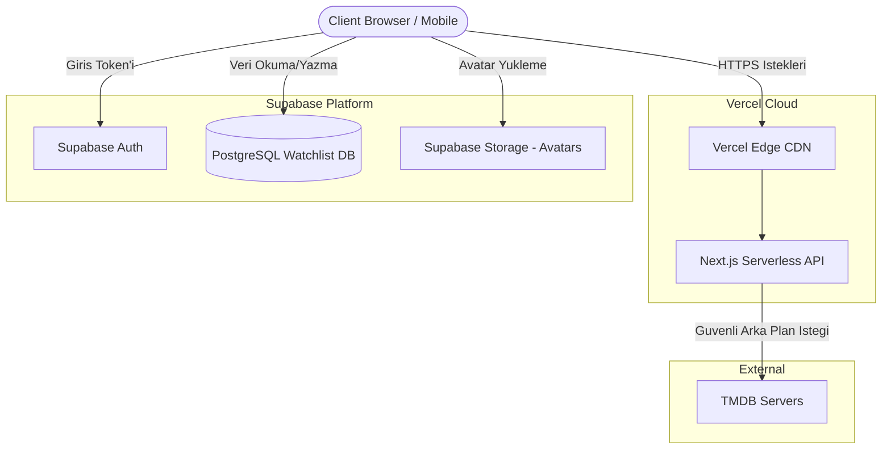

# Title Page

**Project Name:** Movier
**Course:** SWE332 Software Architecture Project Part 2
**Date:** 07.04.2026
**Team Members:** 
- Mehmet Ali Öztürk
- Deniz Eren Gençtürk
- Ali Yekta Dalkılıç

---

## Change History

| Version | Date       | Author(s) | Description |
|---------|------------|-----------|-------------|
| 1.0     | 07.04.2026 | Team      | Initial draft of 4+1 Architectural View Model |

---

## Table of Contents
1. [Scope](#1-scope)
2. [References](#2-references)
3. [Software Architecture](#3-software-architecture)
4. [Architectural Goals & Constraints](#4-architectural-goals--constraints)
5. [Logical Architecture](#5-logical-architecture)
6. [Process Architecture](#6-process-architecture)
7. [Development Architecture](#7-development-architecture)
8. [Physical Architecture](#8-physical-architecture)
9. [Scenarios](#9-scenarios)
10. [Size and Performance](#10-size-and-performance)
11. [Quality](#11-quality)
12. [Appendices](#appendices)

---

## List of Figures
* Figure 1: Logical View - Class/Package Diagram
* Figure 2: Process View - Sequence Diagram
* Figure 3: Development View - Component Diagram
* Figure 4: Physical View - Deployment Diagram

---

## 1. Scope
The Movier application is a comprehensive swipe-based movie discovery platform designed to allow users to search, discover, and review movies. The system supports both anonymous usage (via local storage) and authenticated usage with cloud synchronization. It integrates with external movie databases (TMDB API) to fetch real-time movie data and utilizes Supabase for authentication, database management (PostgreSQL), and avatar storage.

## 2. References
* SWE332 Software Architecture Course Slides (Week 2)
* Kruchten, P. B. (1995). The 4+1 View Model of architecture. IEEE Software.
* Next.js 16 Documentation
* Supabase Documentation (Auth, Postgres, RLS)
* TMDB API Documentation

---

## 3. Software Architecture
Movier adopts a **Cloud-Native / Serverless Architecture** utilizing a **Client-Server** pattern. The frontend is built as a React Server Component (RSC) architecture powered by Next.js 16 (App Router) using React 19, Tailwind CSS 4, and Framer Motion. The backend logic is handled by Next.js Serverless API routes (`/api/tmdb`) to securely communicate with external APIs. Supabase acts as a Backend-as-a-Service (BaaS), handling data persistence via PostgreSQL.

---

## 4. Architectural Goals & Constraints
**Goals:**
* **Fluid User Experience:** Provide a seamless swipe-based UI using Framer Motion.
* **Security:** Keep the TMDB API key secure via server-side API proxying.
* **Hybrid Data Persistence:** Support both offline (local storage) and online (cloud sync) watchlists securely via Supabase RLS (Row Level Security).

**Constraints:**
* Vercel serverless functions execution time limits.
* Free-tier limits of third-party services (TMDB API rate limits and Supabase free-tier database sizes).
* Tight project deadline (April 10th, 2026).

---

## 5. Logical Architecture
The system is divided into three main logical layers: Presentation, Business Logic, and Data Access.

---

## 6. Process Architecture
Describes the runtime behavior, concurrency, and flow of data when a user interacts with the application.

---

## 7. Development Architecture
The repository is structured using the Next.js App Router, separating frontend and backend concerns.

---

## 8. Physical Architecture
The deployment is fully cloud-based, distributed across Vercel and Supabase cloud infrastructure.

---

## 9. Scenarios
**Scenario 1: User Swipes Right on a Movie**
* User views a movie via the Swipe UI (`MovieCard.tsx`).
* User swipes right to "Like" the movie. Framer motion handles the animation.
* The system checks the authentication state (`auth-context.tsx`).
* **If Anonymous:** The `movie_id` is appended to the browser's `localStorage` via `lib/storage.ts`.
* **If Authenticated:** The `movie_id` is sent via Supabase client to the PostgreSQL `watchlist` table via `lib/storage.cloud.ts`.
* The `WatchlistPanel.tsx` re-renders to reflect the new state.

---

## 10. Size and Performance
* **Storage:** To optimize database storage on Supabase, the cloud watchlist only stores the `movie_id`. Full movie details are fetched dynamically.
* **Performance:** Vercel edge caching ensures fast page loads. The server-side TMDB proxy utilizes short caching to reduce redundant network calls.

---

## 11. Quality
* **Reliability:** Utilizing robust cloud providers (Vercel, Supabase) ensures high availability.
* **Security:** Row-Level Security (RLS) policies in PostgreSQL ensure users can only access their own data. Environment variables protect API keys from exposure.

---

## Appendices

### Acronyms and Abbreviations
* **API:** Application Programming Interface
* **UI:** User Interface
* **SPA:** Single Page Application
* **TMDB:** The Movie Database
* **BaaS:** Backend as a Service
* **RSC:** React Server Components
* **RLS:** Row Level Security

### Definitions
* **Supabase:** An open-source alternative providing a PostgreSQL database, Auth, and Storage.
* **Vercel:** A cloud platform for static sites and Serverless Functions used for frontend deployment.

### Design Principles
* **Separation of Concerns (SoC):** UI rendering is strictly isolated from data fetching and state management.
* **Progressive Enhancement:** Works completely offline, and enhances to cloud-sync if the user logs in.