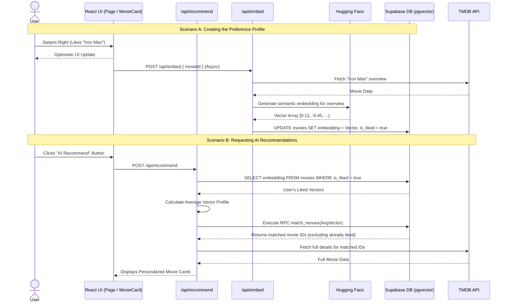
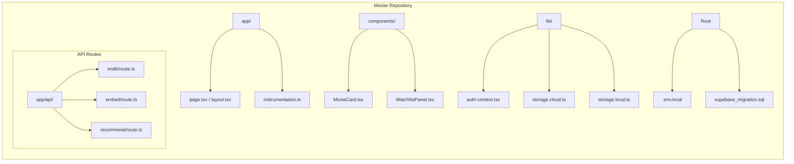
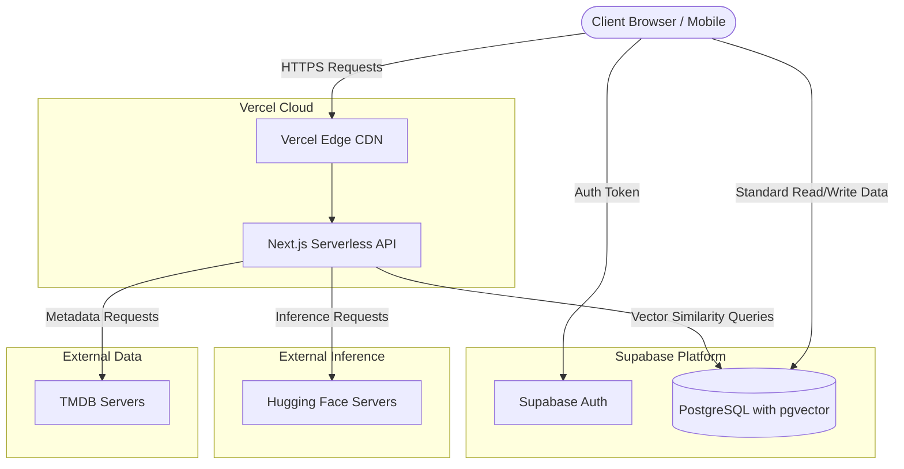

# Title Page

**Project Name:** Movier
**Course:** SWE332 Software Architecture Project Part 2
**Date:** 07.04.2026
**Team Members:** - Mehmet Ali Öztürk
- Deniz Eren Gençtürk
- Ali Yekta Dalkılıç

---

## Change History

| Version | Date       | Author(s) | Description |
|---------|------------|-----------|-------------|
| 1.0     | 07.04.2026 | Team      | Initial draft of 4+1 Architectural View Model |
| 2.0     | 19.04.2026 | Team      | Updated to reflect AI-powered recommendation engine and vector database integration |

---

## Table of Contents
1. [Scope](#1-scope)
2. [References](#2-references)
3. [Software Architecture](#3-software-architecture)
4. [Architectural Goals & Constraints](#4-architectural-goals--constraints)
5. [Logical Architecture](#5-logical-architecture)
6. [Process Architecture](#6-process-architecture)
7. [Development Architecture](#7-development-architecture)
8. [Physical Architecture](#8-physical-architecture)
9. [Scenarios](#9-scenarios)
10. [Size and Performance](#10-size-and-performance)
11. [Quality](#11-quality)
12. [Appendices](#appendices)

---

## List of Figures
* Figure 1: Logical View - Class/Package Diagram
* Figure 2: Process View - Sequence Diagram
* Figure 3: Development View - Component Diagram
* Figure 4: Physical View - Deployment Diagram

---

## 1. Scope
The Movier application is a comprehensive swipe-based movie discovery platform enhanced by artificial intelligence. It allows users to search, discover, and review movies while providing highly personalized, semantic AI-based recommendations. The system supports both anonymous usage (via local storage) and authenticated usage with cloud synchronization. It integrates with external movie databases (TMDB API) to fetch real-time movie data, utilizes Hugging Face for generating semantic text embeddings, and relies on Supabase for authentication, vector database management (PostgreSQL `pgvector`), and user state persistence.

## 2. References
* SWE332 Software Architecture Course Slides (Week 2)
* Kruchten, P. B. (1995). The 4+1 View Model of architecture. IEEE Software.
* Next.js 16 Documentation
* Supabase Documentation (Auth, Postgres, RLS, `pgvector`)
* TMDB API Documentation
* Hugging Face Inference API Documentation

---

## 3. Software Architecture
Movier adopts a **Cloud-Native / Serverless Architecture** utilizing a **Client-Server** pattern. The frontend is built as a React Server Component (RSC) architecture powered by Next.js 16 (App Router) using React 19, Tailwind CSS 4, and Framer Motion.

The backend logic is handled by Next.js Serverless API routes, specifically focusing on secure proxy requests (`/api/tmdb`) and AI inference processing (`/api/embed`, `/api/recommend`). The system utilizes Supabase as a Backend-as-a-Service (BaaS) for relational data and, crucially, as a vector database using the `pgvector` extension to perform cosine similarity searches for semantic movie matching. Hugging Face serves as the external machine learning provider for embedding generation.

---

## 4. Architectural Goals & Constraints
**Goals:**
* **Intelligent Recommendations:** Provide highly accurate, personalized movie recommendations based on the semantic analysis of movie overviews rather than basic genre matching.
* **Fluid User Experience:** Maintain a seamless swipe-based UI using Framer Motion without blocking the main thread during heavy backend AI operations.
* **Security:** Keep the TMDB API key and Hugging Face inference tokens secure via server-side API proxying.
* **Hybrid Data Persistence:** Support both offline (local storage) and online (cloud sync) data flows.

**Constraints:**
* Vercel serverless functions execution time limits (which necessitates asynchronous processing for embedding generation).
* Free-tier limits of third-party services (TMDB API rate limits, Hugging Face API rate limits, and Supabase free-tier database sizes).

---

## 5. Logical Architecture
The system is divided into three main logical layers: Presentation, Business Logic & AI, and Data Access.

```mermaid
flowchart TD
    subgraph Presentation Layer
        UI[React Components / Pages]
        AuthCtx[Auth Context / State]
    end

    subgraph Business Logic & AI Proxy
        TMDB_API[Next.js API Route /api/tmdb]
        Embed_API[Next.js API Route /api/embed]
        Rec_API[Next.js API Route /api/recommend]
        StoreClient[Storage Services / lib]
    end

    subgraph External Systems & Data Layer
        Supabase[(Supabase Postgres & pgvector)]
        TMDB[TMDB External API]
        HF[Hugging Face API]
        LocalDB[(Browser LocalStorage)]
    end

    UI -->|Reads Auth State| AuthCtx
    UI -->|Requests Regular Movies| TMDB_API
    UI -->|Requests AI Recommendations| Rec_API
    UI -->|Saves Liked Movies / Triggers Embed| StoreClient
    
    AuthCtx -->|Auth Operations| Supabase
    TMDB_API -->|Secure Request Hidden API Key| TMDB
    
    StoreClient -->|If Authenticated| Supabase
    StoreClient -->|Calls /api/embed (Async)| Embed_API
    StoreClient -->|If Anonymous User| LocalDB

    Embed_API -->|Requests Vector Embedding| HF
    Embed_API -->|Saves Vector| Supabase
    
    Rec_API -->|Executes RPC Match Function| Supabase
    Rec_API -->|Fetches Full Movie Details| TMDB
```

---

## 6. Process Architecture
Describes the runtime behavior, specifically focusing on the new AI recommendation process.



---

## 7. Development Architecture
The repository is structured using the Next.js App Router, carefully separating UI components, API routes, and cloud service integrations.



---

## 8. Physical Architecture
The deployment is fully cloud-based, distributed across Vercel, Supabase, and Hugging Face infrastructure.



---

## 9. Scenarios
**Scenario 1: Generating Semantic Recommendations**
* User clicks the "AI Analyze" button.
* The frontend forces Vercel to bypass the cache and calls `/api/recommend`.
* The server retrieves all movies marked as `is_liked: true` by the user from the Supabase database.
* The server calculates an "average preference vector" from the user's liked movies.
* A Remote Procedure Call (RPC) named `match_movies` is executed on Supabase. Using the `pgvector` extension, it calculates the cosine similarity between the user's average vector and the rest of the database, efficiently returning the closest matches.
* The server filters out movies the user has already liked.
* The server fetches high-resolution metadata for the remaining matched IDs from TMDB and returns them to the client for display.

---

## 10. Size and Performance
* **Storage:** The `movies` table in Supabase requires increased storage capacity due to the 384-dimensional floating-point vectors stored for each movie.
* **Performance:** * To prevent blocking the UI, vector generation (`/api/embed`) is performed asynchronously in the background.
    * `force-dynamic` is utilized on AI API routes to ensure fresh recommendations rather than stale Vercel edge-cached responses.

---

## 11. Quality
* **Reliability:** Utilizing robust cloud providers (Vercel, Supabase) ensures high availability.
* **Modularity:** The introduction of the AI recommendation engine was achieved without altering the core swipe mechanism, demonstrating strong separation of concerns.

---

## Appendices

### Acronyms and Abbreviations
* **API:** Application Programming Interface
* **UI:** User Interface
* **SPA:** Single Page Application
* **TMDB:** The Movie Database
* **BaaS:** Backend as a Service
* **RSC:** React Server Components
* **RLS:** Row Level Security
* **RPC:** Remote Procedure Call

### Definitions
* **Supabase (`pgvector`):** An open-source PostgreSQL extension utilized for storing vector embeddings and executing exact and approximate nearest-neighbor search.
* **Vector Embedding:** A numerical representation of text (e.g., a movie overview) capturing its semantic meaning.
* **Hugging Face:** A platform and API provider utilized for running machine learning inference (generating text embeddings).